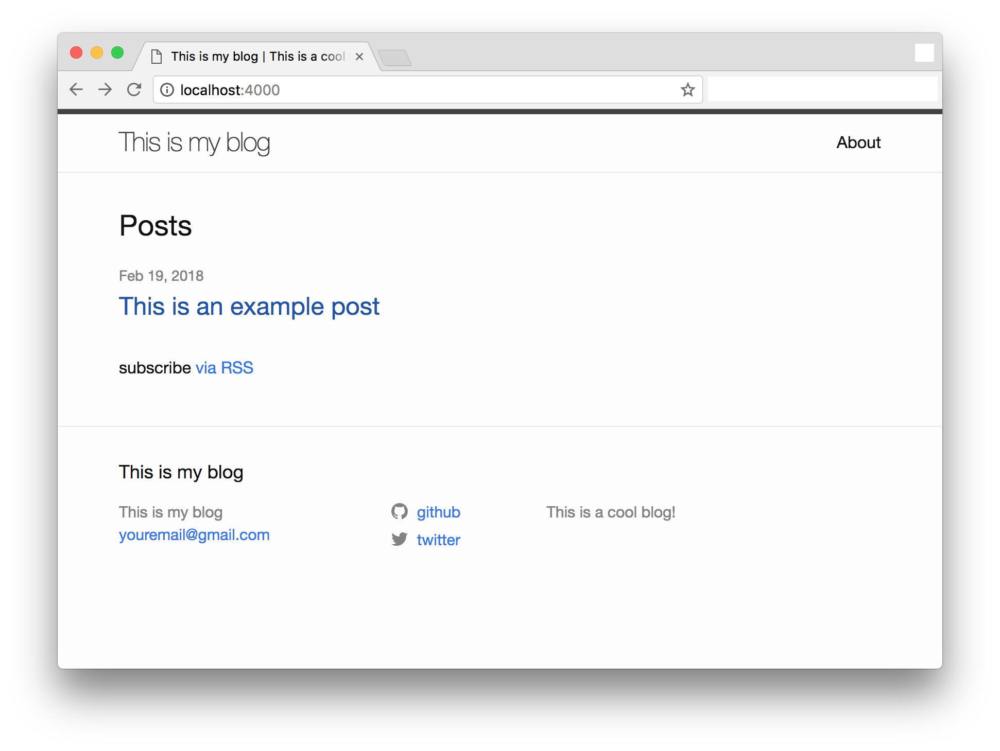
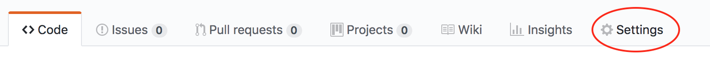

# Jekyll boilerplate

This a boiler plate to create a blog using [Jekyll](using https://jekyllrb.com). It uses Docker to easily setup your local environment for working with your blog before hosting it with a hosting provider or using [Github Pages](https://pages.github.com/).

## Dependency

- [Docker](https://www.docker.com/)
- [Jekyll docker image](https://github.com/envygeeks/jekyll-docker/blob/master/README.md)

## Features

- Supports feature described [here](https://github.com/envygeeks/jekyll-docker/blob/master/README.md)

## Docker compose file

```yaml
version: '3'
services:
  site:
    image: jekyll/jekyll:latest
    container_name: blog
    hostname: blog
    volumes:
      - $PWD:/srv/jekyll/site
      - $PWD/bundle:/usr/local/bundle:rw
    working_dir: /srv/jekyll/site
    command: sh -c "/usr/jekyll/bin/jekyll s --livereload"
    ports:
      - 4000:4000
      - 35729:35729
      - 3030:3000
      -   80:4000
```

## Run Jekyll docker container

This will start the container and run jekyll with livereload using the docker file as shown above. It will automatically download the latest Jekyll docker image and create a bundle folder to install Jekyll dependencies.  

```bash
cd <project home>
docker-compose up -d
```

To bring it down,

```bash
cd <project home>
docker-compose down
```

## Screenshot



## Create new blog posts

Sample blog post can be found under _posts/ folder.

## Hosting your blog

#### Hosting provider

Static site is generated under _site/ folder. You can host this in using AWS for any hosting provider.

#### Github Pages

Github Pages offers a way to host Jekyll blogs with just your github account. 

- Create a repo with name "<github handle>.github.io"
- Upload a clone of this repo
- Go to settings

- Enable Pages using the master branch and save.


Your blog should be availble at https://\<github handle\>.github.io

## Contributing Guide

See [CONTRIBUTING.md](CONTRIBUTING.md)

## Change Log

See [CHANGELOG.md](CHANGELOG.md)

## License

See [LICENSE](LICENSE)
